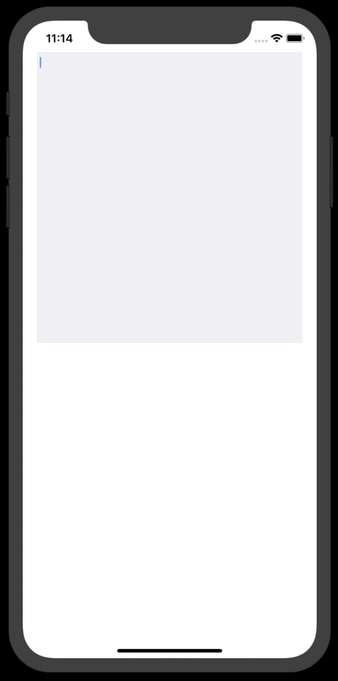

# WordSuggestion

[](https://cocoapods.org/pods/WordSuggestion)
[](https://cocoapods.org/pods/WordSuggestion)
[](https://cocoapods.org/pods/WordSuggestion)


Swift implementation for N-Gram word prediction. Modified from the Objective-C version [WordSuggestion](https://github.com/chika-kasymov/WordSuggestion). Replace CoreData database store with Realm.

## Usage
### Setup
```swift
    // Setup realm
    let realm: Realm = {
        var config = Realm.Configuration()
        let realmName = "WordPredictor_default"
        config.fileURL = config.fileURL!.deletingLastPathComponent().appendingPathComponent("\(realmName).realm")
        config.objectTypes = [NGram1.self, NGram2.self, NGram3.self, NGram4.self]
        try? FileManager.default.createDirectory(at: config.fileURL!.deletingLastPathComponent(), withIntermediateDirectories: true, attributes: nil)

        return try! Realm(configuration: config)
    }()
    
    // Only needs load at the first time app launch
    if wordPredictor.needLoadNgramData {
        wordPredictor.load { error in
            print(error)
        }
    }
```

### Predict
```swift
    func textViewDidChange(_ textView: UITextView) {
        wordPredictor.suggestWords(for: textView.text) { suggestions in
            // …            
        }
    }
```

For more detail please check the Example app demo.


## Demo


## License
MIT License